# Lec03-Feedback

## 1. 描述-DT

当前信号取决于过去的信号

例如 y[n] = y[n-1]过去的状态

### **有反馈信号**：**Cyclic 循环系统** 

**Ex.**

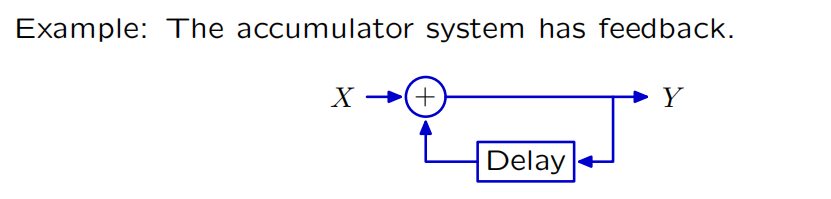

$$
Y = X + RY\\
y[n] = x[n] + y[n-1]
$$

- 有**返回路**的通路

- 结果与**过去有关**

### **无反馈信号**：**Acyclic非循环系统**

  

  **Ex.**

  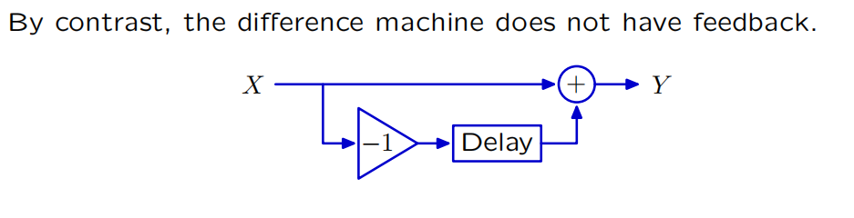

  

## 2. 推导

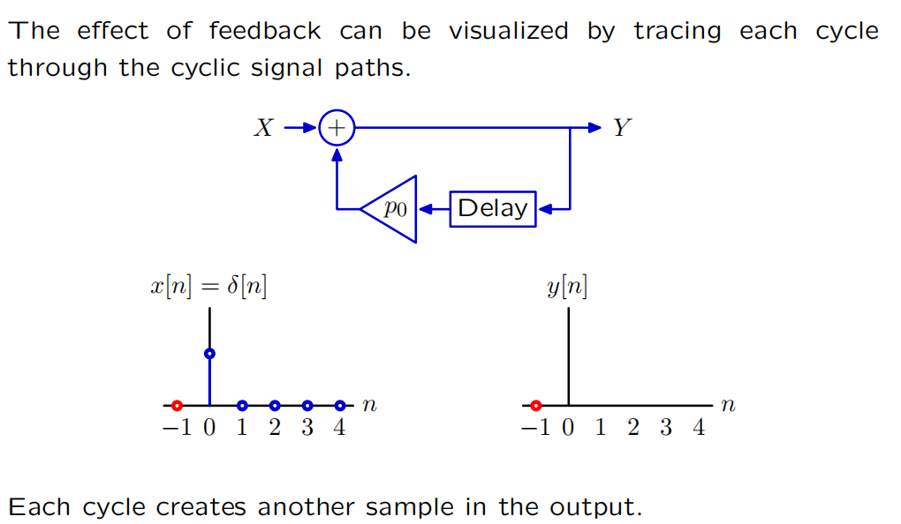

!!!NOTE
      注意x[n]为**激励信号**，只有**n=0时x[n]=1**

$$
y[0] = x[0] = 1
$$

$$
y[1] = x[1] + p_0y[0] = p_0
$$

$$
**直路加上环路**
$$

$$
y[2] = x[2] + p_0y[1] = p_0^2
$$

$$
……  \\= p_0^n
$$

### 有限/无限脉冲响应

**Acyclic 非循环系统**的冲激响应具有**有限**的持续时间，

**Cyclic 循环系统**的冲激响应可以具有**无限**的持续时间。

## 3. 几何增长

### 1. 收敛&发散 

如果穿越周期会减小或增加信号的大小，那么基本模式将分别衰减或增长。
如果响应**衰减到零**，那么我们就说它**收敛**了。否则，我们就说它是**发散**了。

These geometric sequences are called **fundamental modes** **基本模态**

$$
P_0^n = 0.5^n =>收敛
$$

$$
P_0^n = 1.2^n =>发散
$$

$$
Y = 1.2RX + 0.5 RY \\
==\\
y[n] = 1.2x[n-1]+0.5y[n-1]\\
x[n] = \delta[n] ->x[0]=1,else=0
$$

$$
y[0] = 0
$$

$$
y[1] = x[0] * 1.2= 1.2
$$

$$
y[2] = x[1] * 1.2 + y[0] * 0.5 * 1.2 = 0
$$

$$
y[3] = x[2] * 1.2 +y[1] * 0.5 * 1.2 = 0.6 * 1.2
$$

$$
…… \\
=> 0 ， 0.6 ^ n * 1.2
$$

**收敛**

---

### 2. 极点 Poles：

#### *总结：
$$
y[n] = 
\left
\{
\begin{aligned}
p^n_0 &,& n>=0;\\
0&,&else
\end{aligned}
\right.
$$

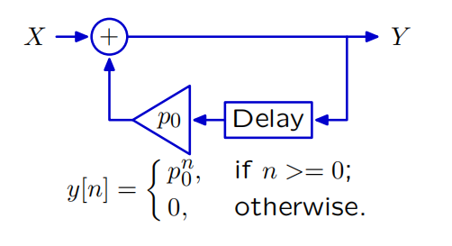

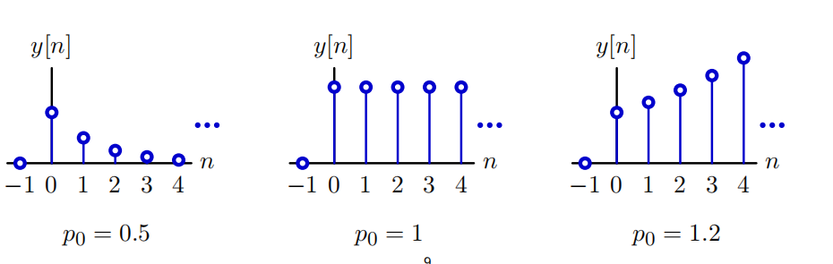

##### 敛散性：

$$
\left
\{
\begin{aligned}
p_0 < |1| &; \longrightarrow 收敛\\
p_0 > |1| &; \longrightarrow 发散
\end{aligned}
\right.
$$

##### 正负性：

$$
\left
\{
\begin{aligned}
p_0 < 0 &; \longrightarrow 符号翻转\\
p_0 > 0 &; \longrightarrow 单调
\end{aligned}
\right.
$$

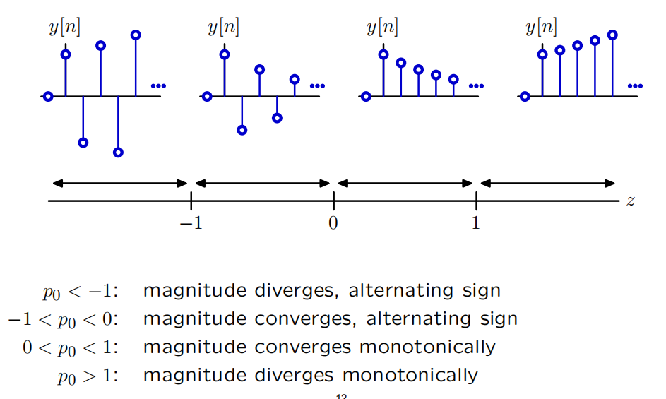

## 4. 二阶循环系统

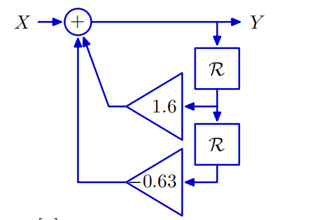

$$
Y = X + 1.6RY -0.63R^2Y
$$

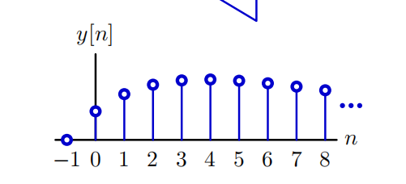

先增加后减少 - **没有几何增长**

### 1. 一阶系统转换

$$
Y = X + p_0RY\\
\frac{Y}{X} = \frac{1}{1-p_0R}
$$

- **转换为差分方程**
  $$
  y[n] = x[n] + p_0y[n-1];n\geq0\\
  y[n] = p_0^n;n\geq0
  $$
  

---

### 2. 高阶系统转换

$$
Y = X + 1.6RY -0.63R^2Y
$$

##### 1. **因式分解**

$$
(1-0.7R)(1-0.9R)Y = X
$$

##### 2. **部分分式** 

$$
\frac{Y}{X} &=& \frac{1}{(1-0.7R)(1-0.9R)}\\
&=&\frac{4.5}{(1-0.9R)} - \frac{3.5}{(1-0.7R)}
$$

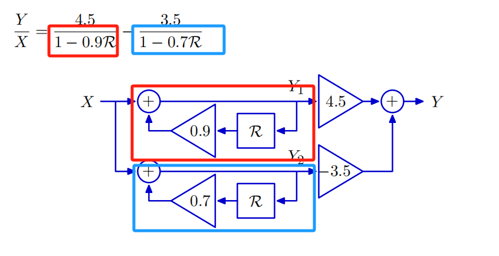

##### 3. **差分方程**

$$
y[n] = 4.5 * (0.9)^n -3.5 * (0.7)^n
$$

### sup1. 系统方程 System functional

- 后面部分不与任何状态相关，是系统本身的部分

**ex**.

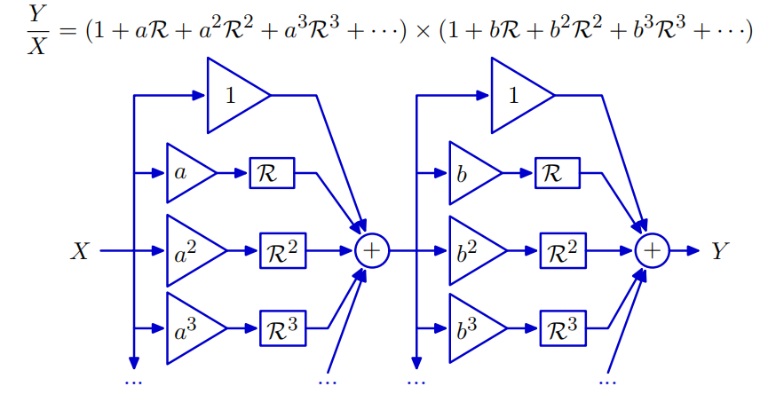

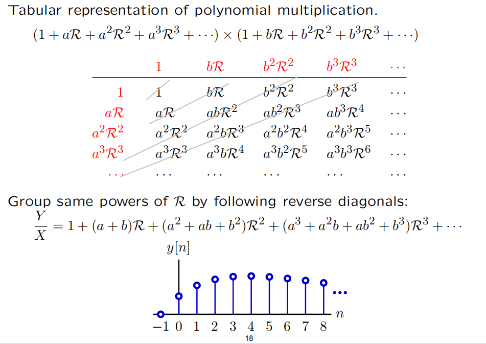

### sup2. 求极点

##### 1. 因式分解-部分分式

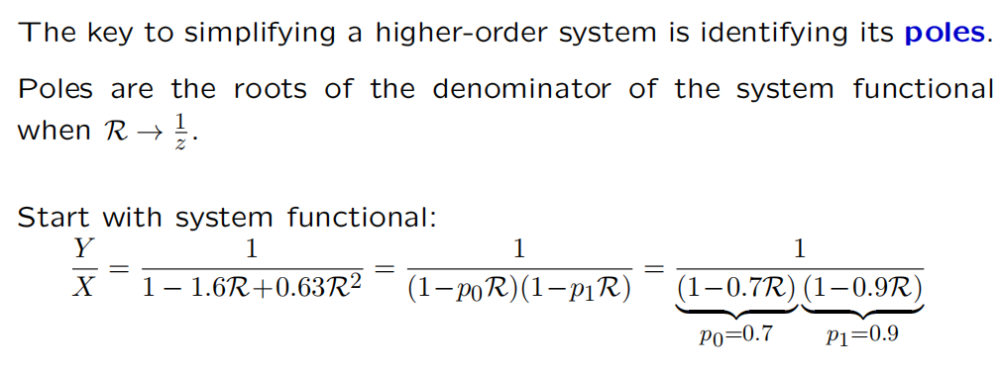

##### 2. **R = 1/z**  代入求根 

- **ex.**

  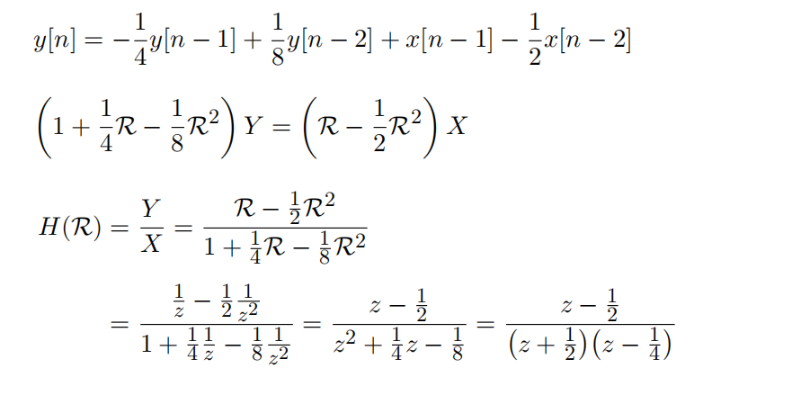

$$
 => z_1 = -1/2 , z_2 = 1/4
$$

### sup3. 斐波那契系统 Fibonacci system

$$
y[0] = 1, y[1] = 1, y[2] = 2 ,y[3] = 3 , y[4] = 5,y[5] = 8
……
$$

$$
y[n] = x[n] + y[n-1] + y[n-2] 
$$

$$
Y = X + RY + R^2Y
$$

$$
Y/X = 1/(1 - R - R^2)
$$

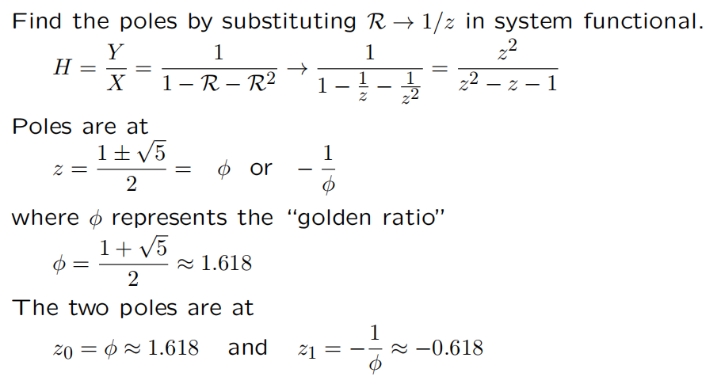

### sup4. 复极点 Complex Poles

 

# CT Feedbcak

# Summary

- 由加法器、增益和延迟组成的系统可以通过其极点来表征。

- 系统的**极点**决定了其**基本模态**。

- 系统的单位样本响应可以表示为**基模**的**加权和**。

- 这些性质是从系统函数的多项式解释中得出的。

## 极点比较 CT&DT

